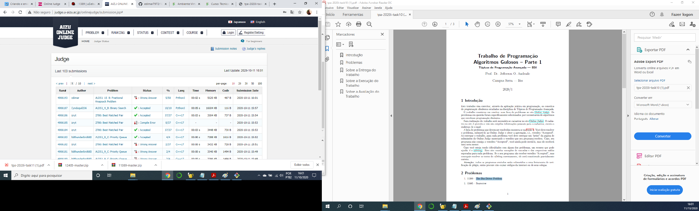

# Trabalho de Programação -- Algoritmos Gulosos -- Parte 2
**Autor:** Edimar Antonio da Cruz
**Data:** 11 de outubro de 2020
**Problema:** ALDS1_15_B -- – Fractional Knapsack Problem
## Sobre a Solução
Este diretório contém o código fonte gerado para solucionar o problema ALDS1_15_B
do *Aizu Online Judge*. O problema recebeu veredito Wrong Answer (WA), como mostrado na
figura abaixo:

O programa foi desenvolvido em Python.
Foi encontrado solução para os casos testes e não foi aceito pelo juiz, de qualquer forma segue 
o código
